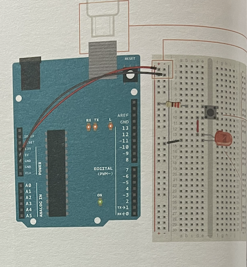
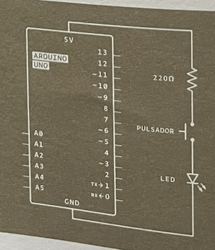
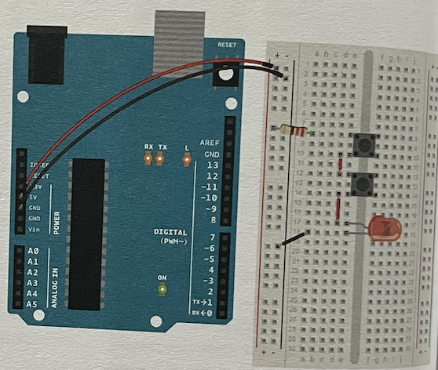
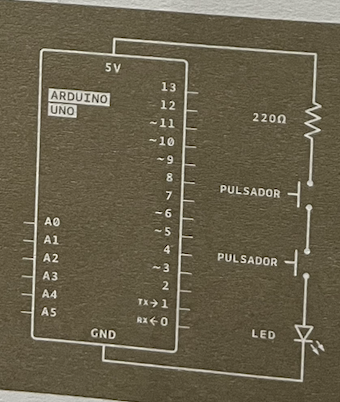
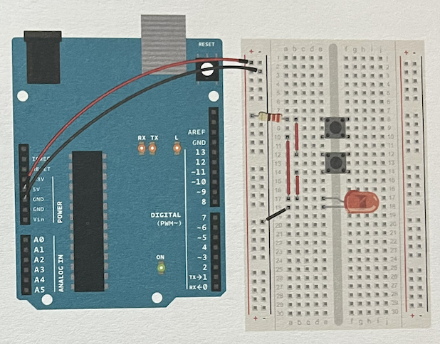
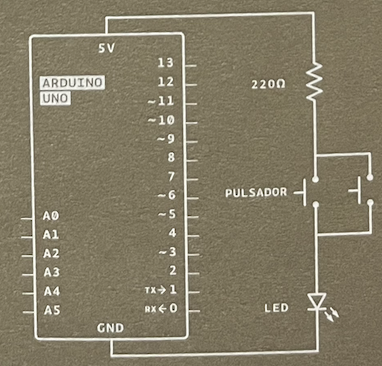
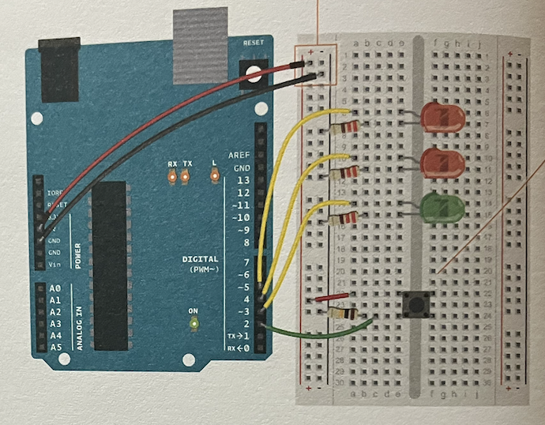
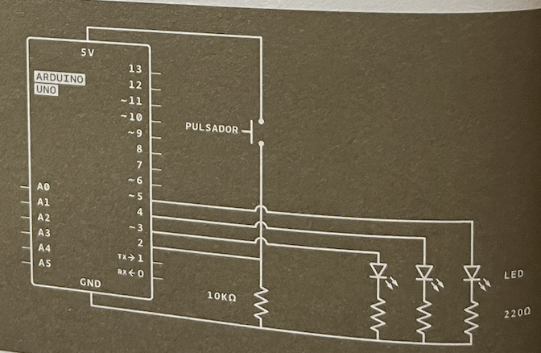

# Proyecto 1

**Básico de armado de circuitos**

- Circuito en serie
- Circuito en Paralelo

| Demostracion                                                                   | Esquemático                                                                          | Diagrama Eléctrico                                                             |
| ------------------------------------------------------------------------------ | ------------------------------------------------------------------------------------ | ------------------------------------------------------------------------------ |
|    |    |    |
|  |     |     |
|  |  |  |

 

# Proyecto 2

**Básicos de programación en Arduino.**

Cuando se le da click al botón, se prenden los dos LEDs rojos en secuencia, cuando no está presionado, el LED verde está encendido.

[Código aquí](./Proyecto2NaveEspacial/Proyecto2NaveEspacial.ino)

| Demostracion                                                                 | Esquemático                                                                 | Diagrama Eléctrico                                                    |
| ---------------------------------------------------------------------------- | --------------------------------------------------------------------------- | --------------------------------------------------------------------- |
|  |  |  |

 
